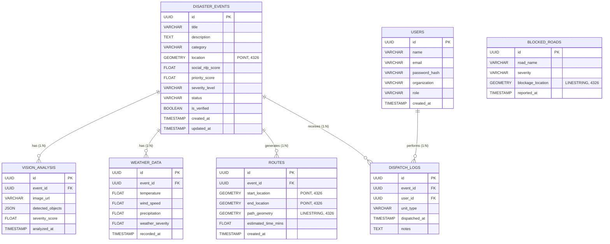

# NEXUS: System Architecture & ER Diagram

## 1. System Architecture

The NEXUS Multi-Modal Disaster Response Agent follows a modern, decoupled microservices-inspired architecture designed for high availability and low latency during critical emergencies. 

### Architecture Flow
1. **Data Ingestion Layer**: 
   - **Frontend (React)**: Emergency responders interact with the React dashboard.
   - **Social Media Agent**: Continuously polls/simulates ingestion of unstructured text data from the public.
2. **Analysis & Processing Layer (FastAPI)**:
   - **Vision Agent**: Extracts severity metrics from user-uploaded images or drone feeds using computer vision models.
   - **Weather Agent**: Cross-references location coordinates with meteorological APIs to add an environmental severity weight.
   - **NLP Engine**: Extracts disaster keywords and urgency scores from the unstructured text.
3. **Cross-Modal Decision Engine**:
   - Acts as the central brain. It fuses the independent scores (Vision, NLP, Weather) using a weighted algorithm to generate a unified **Priority Score**.
4. **Logistics & Routing Engine**:
   - If the Priority Score triggers the threshold, the Logistics Agent automatically plots the fastest rescue route using the **A* Search Algorithm**, calculating path segments that avoid known blocked geographic areas (stored in PostGIS).
5. **Data Layer (PostgreSQL + PostGIS)**:
   - All events, scores, routes, and geographic data (points, linestrings) are stored in normalized relational tables.

---

## 2. Entity-Relationship (ER) Diagram

The following diagram illustrates the PostgreSQL database schema used by NEXUS. The database is heavily reliant on **PostGIS** for spatial data processing.

### Table Details
- **disaster_events**: Central entity containing the extracted NLP score and the final priority score after cross-modal fusion.
- **vision_analysis**: Stores object detection arrays and visual severity scores linked to an event.
- **weather_data**: Stores meteorological metadata at the time of the event.
- **routes**: Stores the computed A* logistics path (as a `LINESTRING`) for frontend map rendering.
- **blocked_roads**: A standalone table used by the Logistics logic to compute penalties/obstacles during pathfinding.
