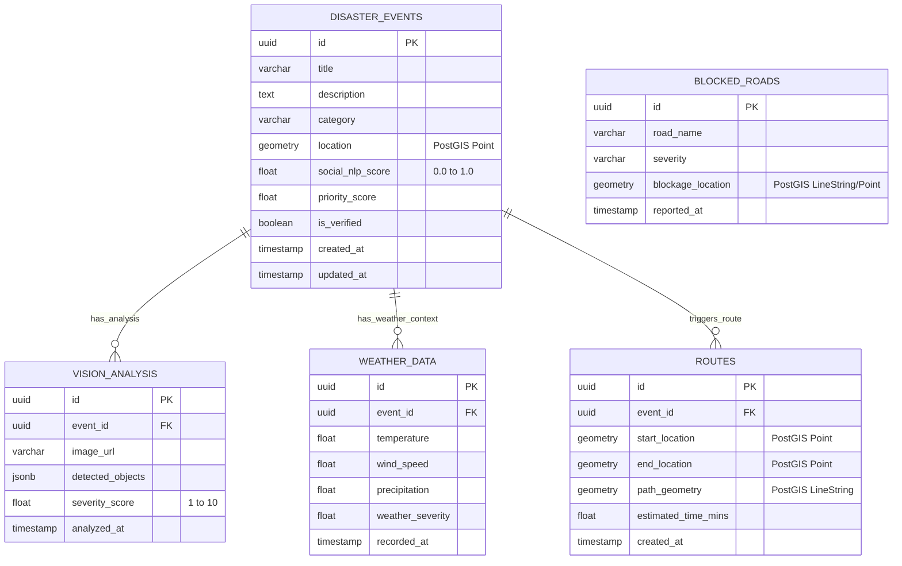

# NEXUS Database ER Diagram

Below is the text representation of the ER diagram illustrating the database schema and relations for the NEXUS Multi-Modal Disaster Response Agent.

### Key Considerations
1. **Performance**: GIST Indexes are created for all `GEOMETRY` columns (`location`, `blockage_location`, `start_location`, `end_location`) to optimize spatial queries used mostly during route calculation and visualization.
2. **PostGIS**: Requires PostGIS to be enabled (`CREATE EXTENSION postgis;`).
3. **Foreign Keys**: `ON DELETE CASCADE` ensures that if an event is deleted, all related vision data, weather context, and associated generated rescue routes are cleared up securely.
